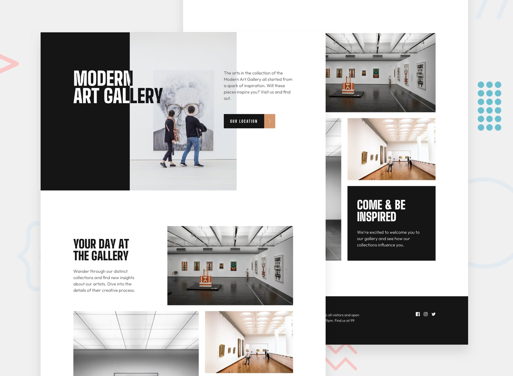

# 🎨 Art Gallery Landing Page

A responsive landing page for a fictional art gallery website, built using **HTML5** and **CSS3**.
This project focuses on clean layout structure, responsive design, and modern CSS techniques.

---

## 🌐 Live Preview

You can view the project here:

🔗 https://your-live-demo-link.com

---

## 📸 Project Preview



---

## 🛠️ Technologies Used

* **HTML5**
* **CSS3**
* **Responsive Design**
* **Mobile-First Layout**

---

## 📂 Project Structure

```
art-gallery-landing-page
│
├── assets
│   ├── images
│   └── icons
│
├── index.html
├── style.css
└── README.md
```

---

## 🎯 Project Goals

The purpose of this project is to:

* Practice semantic HTML structure
* Improve CSS layout skills
* Build a **fully responsive landing page**
* Follow basic **front-end best practices**

---

## 📱 Responsiveness

The layout adapts to different screen sizes:

* 📱 Mobile devices
* 💻 Tablets
* 🖥️ Desktop screens

Media queries were used to ensure a smooth responsive experience.

---

## 🚀 How to Run the Project

1. Clone this repository:

```
git clone https://github.com/your-username/art-gallery-landing-page.git
```

2. Navigate to the project folder.

3. Open the `index.html` file in your browser.

---

## ✨ Future Improvements

* Add subtle animations
* Improve accessibility (ARIA attributes)
* Implement a dark mode
* Add a gallery filtering system with JavaScript

---

## 👨‍💻 Author

Developed by **Gabriel Alves**

GitHub: https://github.com/gabriel707alves
LinkedIn: https://linkedin.com/in/gabriel707alves


